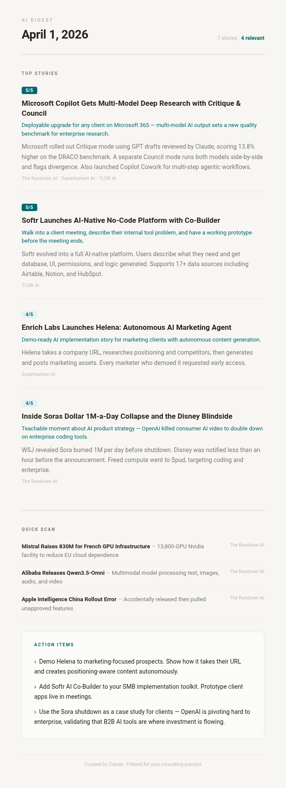

# AI Digest

A self-hosted Python agent that reads three AI newsletters every morning, filters and ranks stories by relevance to your professional focus, and emails you a curated briefing before your day starts.

Runs on your Mac with a single cron job. No subscriptions, no SaaS dependencies — just a Python script, an API key, and your Gmail account.



---

## How It Works

```
┌──────────────────────────────────────────────────────────────┐
│                        8:00 AM                               │
│                    macOS triggers                             │
│                    launchd job                                │
└──────────────┬───────────────────────────────────────────────┘
               │
               ▼
┌──────────────────────────────────────────────────────────────┐
│                     FETCH                                     │
│                                                               │
│   The Rundown AI ──┐                                         │
│   Superhuman AI  ──┼──▶  Raw newsletter text (3 sources)     │
│   TLDR AI ─────────┘                                         │
└──────────────┬───────────────────────────────────────────────┘
               │
               ▼
┌──────────────────────────────────────────────────────────────┐
│                   ANALYZE                                     │
│                                                               │
│   Claude Sonnet receives:                                     │
│   • Combined newsletter content                               │
│   • Your consulting niche description                         │
│                                                               │
│   Claude returns structured JSON:                             │
│   • Deduplicated stories across sources                       │
│   • Relevance score (1–5) per story                          │
│   • "Why it matters" for your niche                          │
│   • 2–3 specific action items                                │
└──────────────┬───────────────────────────────────────────────┘
               │
               ▼
┌──────────────────────────────────────────────────────────────┐
│                   DELIVER                                     │
│                                                               │
│   • Formatted HTML email → your inbox                        │
│   • Plain text fallback for any email client                 │
│   • Local archive saved to ~/.ai-digest/digests/             │
└──────────────────────────────────────────────────────────────┘
```

The entire process takes about 30 seconds per run.

---

## Cost Analysis

AI Digest uses the Anthropic API. Here's what a typical run costs:

### Per Run

| Component | Tokens | Rate | Cost |
|-----------|--------|------|------|
| Input (system prompt + newsletter text) | ~6,400 | $3.00 / MTok | $0.019 |
| Output (structured JSON digest) | ~2,000 | $15.00 / MTok | $0.030 |
| **Total per run** | | | **$0.049** |

### Projected Annual Cost

| Frequency | Model | Annual Cost |
|-----------|-------|-------------|
| Weekdays (260 runs/yr) | Claude Sonnet 4.6 | **~$12.78** |
| Weekdays (260 runs/yr) | Claude Haiku 4.5 | **~$4.26** |

To switch to Haiku for lower cost, change `_MODEL` in `src/digest.py` to `"claude-haiku-4-20250506"`.

### What Else You Need

| Resource | Cost |
|----------|------|
| Gmail (SMTP sending) | Free |
| Python 3.9+ | Pre-installed on macOS |
| `certifi` package | Free |

**Total cost of ownership: approximately $5–$13 per year** depending on your model choice.

---

## Setup

### Prerequisites

- macOS with Python 3.9+
- An [Anthropic API key](https://console.anthropic.com/settings/keys)
- A [Gmail App Password](https://myaccount.google.com/apppasswords) (requires 2FA enabled)

### Installation

```bash
# Clone the repository
git clone https://github.com/YOUR_USERNAME/ai-digest.git
cd ai-digest

# Install the one dependency
pip3 install certifi

# Run interactive setup (saves to ~/.ai-digest/config.json)
python3 setup_config.py

# Test it
python3 main.py

# Schedule it (weekdays at 8 AM)
python3 install_schedule.py
```

The setup script will prompt you for:
1. **Anthropic API key** — for Claude to analyze and rank stories
2. **Gmail address** — sender address for the digest email
3. **Gmail App Password** — a 16-character app-specific password (not your regular password)
4. **Recipient email** — where to send the digest (defaults to your Gmail)
5. **Consulting niche** — a short description of your focus area for relevance scoring

### Gmail App Password

1. Go to [myaccount.google.com/apppasswords](https://myaccount.google.com/apppasswords)
2. Two-factor authentication must be enabled first
3. Enter a name (e.g., "AI Digest") and click Create
4. Copy the 16-character password

---

## Project Structure

```
ai-digest/
├── main.py                 # Entry point
├── setup_config.py         # Interactive configuration
├── install_schedule.py     # macOS launchd scheduler
├── requirements.txt        # Dependencies (certifi only)
├── src/
│   ├── config.py           # Config loading and validation
│   ├── fetchers.py         # Newsletter content fetching
│   ├── digest.py           # Claude API integration and scoring
│   ├── email_template.py   # HTML email rendering
│   └── mailer.py           # Gmail SMTP delivery
└── docs/
    └── email-preview.png   # Sample email screenshot
```

### Relevance Scoring

Each story is scored 1–5 based on your configured niche:

| Score | Meaning | Example |
|-------|---------|---------|
| **5** | Directly actionable | New AI tool your clients could deploy this week |
| **4** | Highly relevant | Major platform update, enterprise AI trend |
| **3** | Moderately relevant | Research with business implications, funding signals |
| **2** | Tangentially relevant | General AI news, consumer products |
| **1** | Low relevance | Entertainment AI, niche academic research |

Stories scored 3–5 appear in the **Top Stories** section with full summaries. Stories scored 1–2 appear in **Quick Scan** as one-liners.

---

## Configuration

All configuration is stored in `~/.ai-digest/config.json`:

```json
{
  "anthropic_api_key": "sk-ant-...",
  "gmail_address": "you@gmail.com",
  "gmail_app_password": "abcd efgh ijkl mnop",
  "recipient_email": "you@gmail.com",
  "consulting_niche": "AI consulting firm helping businesses implement AI tools..."
}
```

You can also set values via environment variables: `ANTHROPIC_API_KEY`, `GMAIL_ADDRESS`, `GMAIL_APP_PASSWORD`, `DIGEST_RECIPIENT`, `DIGEST_NICHE`.

To re-run setup: `python3 setup_config.py`

---

## Useful Commands

| Action | Command |
|--------|---------|
| Run manually | `python3 main.py` |
| View logs | `cat ~/.ai-digest/logs/digest.log` |
| Browse past digests | `ls ~/.ai-digest/digests/` |
| Open today's digest in browser | `open ~/.ai-digest/digests/$(date +%Y-%m-%d).html` |
| Update configuration | `python3 setup_config.py` |
| Change schedule time | Edit `Hour` in `~/Library/LaunchAgents/com.ai-digest.daily.plist` |
| Stop the schedule | `python3 install_schedule.py --uninstall` |
| Restart the schedule | `python3 install_schedule.py` |

---

## Newsletter Sources

| Newsletter | Subscribers | What It Covers |
|-----------|-------------|----------------|
| [The Rundown AI](https://www.therundown.ai) | 2M+ | Daily AI news, tools, and industry developments |
| [Superhuman AI](https://www.superhuman.ai) | 1.5M+ | AI tools, tutorials, and productivity workflows |
| [TLDR AI](https://tldr.tech/ai) | 500K+ | AI research, tools, and machine learning news |

The agent fetches the latest issue from each source's public archive. If a source is unavailable on a given day, the digest proceeds with the remaining sources (minimum 2 of 3 required).

---

## Customization

**Change your niche** — Edit `consulting_niche` in `~/.ai-digest/config.json`. This is the context Claude uses to score relevance, so updating it will shift which stories rank highest.

**Add newsletter sources** — Add a new fetch function in `src/fetchers.py` and include it in the `newsletters` dict in `main.py`.

**Swap the model** — Change `_MODEL` in `src/digest.py`. Use `claude-haiku-4-20250506` for lower cost or `claude-opus-4-20250514` for highest quality.

**Change the schedule** — Edit the `Hour` and `Minute` values in the launchd plist at `~/Library/LaunchAgents/com.ai-digest.daily.plist`, then run:

```bash
launchctl unload ~/Library/LaunchAgents/com.ai-digest.daily.plist
launchctl load ~/Library/LaunchAgents/com.ai-digest.daily.plist
```

---

## Troubleshooting

**SSL certificate errors** — The script uses `certifi` to handle macOS SSL certificates. If you still see errors, run `pip3 install --upgrade certifi`.

**Email not sending** — Check `~/.ai-digest/logs/digest-error.log`. The most common fix is regenerating your Gmail App Password.

**"Application-specific password required"** — You're using your regular Gmail password instead of an App Password. Create one at [myaccount.google.com/apppasswords](https://myaccount.google.com/apppasswords).

**Script not running on schedule** — Your Mac needs to be awake at the scheduled time. macOS will run missed jobs when the Mac next wakes up.

**Claude API errors** — Verify your API key and check your balance at [console.anthropic.com](https://console.anthropic.com/settings/billing).

---

## License

MIT License. See [LICENSE](LICENSE) for details.
